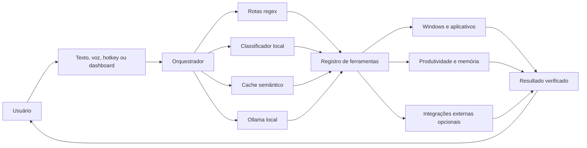

# Auditoria funcional do Paçoca

Data-base: 2026-08-09. Branch: `homologacao`.

## Fluxo atual

## Inventário

- Entrada: CLI, wake word, push-to-talk, Whisper, hotkeys, overlay e dashboard.
- IA: regex, TF-IDF, cache semântico, Ollama e Groq opcional.
- Computador: apps, arquivos, pastas, navegador, volume, brilho, processos e mídia.
- Conteúdo: pesquisa, resumo, explicações, OCR, clipboard e Obsidian.
- Produtividade: foco, uso de apps, rotinas, lembretes, briefing e reuniões.
- Memória: contexto, preferências, vocabulário, hábitos, confiança e KB semântica.
- Integrações: Spotify, Google Calendar/Drive, WhatsApp, clima e câmbio.
- Operação: dashboard, telemetria, logs, readiness, backup, plugins e testes.
- MCP: servidor local inicial com ferramentas de baixo risco via `stdio`.

## Problemas priorizados

### P0 — segurança e limites

- [x] Criação e alteração de eventos agora exigem confirmação.
- [x] `git pull` e formatação do projeto agora exigem confirmação.
- [x] Rotas diretas e NLU agora usam mesmo canal de confirmação, inclusive voz.
- [x] Servidor MCP inicial não publica ações destrutivas, Git ou mensagens externas.
- [x] Comunicações externas usam simulação fail-closed; modo real exige três travas, whitelist e confirmação.
- [x] Backup automático nunca autoriza upload cloud e informa simulação.
- [ ] Unificar política de risco hoje dividida entre rotas, `security`, `trust` e registry.
- [ ] Criar confirmação remota autenticada antes de publicar ferramentas de escrita no MCP.
- [x] Redigir telefones, e-mails, tokens e senhas em logs, inclusive tracebacks.
- [x] Remover telefone pessoal da configuração versionada e adicionar `config.local.yaml` ignorado.
- [ ] Avaliar remoção do telefone do histórico Git; exige reescrita coordenada do repositório.
- [ ] Classificar e redigir dados sensíveis em memória, clipboard e screenshots.
- [x] Remover `shell=True` de dev tools e resolver wrappers Windows com argumentos controlados.
- [x] Impedir criação e sobrescrita de arquivos fora da pasta de trabalho.

### P1 — arquitetura do produto planejado

- [x] Criar servidor MCP real usando SDK oficial.
- [ ] Criar cliente/orquestrador MCP para Ollama e múltiplos executores.
- [ ] Criar Desktop Agent leve com conexão de saída autenticada ao servidor central.
- [ ] Adicionar identidade, permissões e presença por dispositivo.
- [ ] Implementar canal privado remoto sem expor Ollama ou executor na internet.
- [ ] Persistir filas, timers e schedules para sobreviver a reinícios e suspensão.

### P1 — confiabilidade funcional

- [ ] Adicionar testes reais por sistema operacional para apps, áudio, brilho e mídia.
- [x] Garantir banco IANA `tzdata` no Windows para Calendar respeitar fuso configurado.
- [ ] Verificar estado pós-ação em vez de confiar somente no retorno do subprocesso.
- [ ] Reduzir exceções silenciosas e registrar causa útil sem vazar dados pessoais.
- [x] Tratar falhas parciais do briefing por fonte e informar seção indisponível.
- [x] Criar manifesto SHA-256, detectar corrupção e testar restauração em pasta isolada.
- [ ] Adicionar auditoria e rollback para aprendizado persistente.

### P2 — custo zero e operação local

- [x] Ollama permanece provider padrão.
- [x] Embeddings agora usam Ollama por padrão.
- [x] TTS agora usa pyttsx3 offline por padrão.
- [ ] Integrar Piper ou Kokoro como voz local mais natural.
- [x] Remover linguagem que apresenta free tier cloud como garantia permanente.
- [ ] Criar perfis de modelo conforme RAM, VRAM e CPU disponíveis.

### P2 — UX

- [x] Dashboard ganhou cabeçalho, navegação consistente e layout responsivo.
- [x] Mostrar modo externo e prévia de risco antes de comandos no dashboard.
- [ ] Criar painel de memória, privacidade, retenção e exclusão.
- [ ] Mostrar progresso de tarefas longas e botão global de cancelamento.
- [ ] Adicionar estado offline, dispositivo alvo e origem da resposta.
- [ ] Criar editor de rotinas estruturado; evitar ação livre em texto.

## Critério de promoção

`homologacao` só deve ir para `master` quando:

1. Testes e Ruff estiverem verdes.
2. Fluxos reais de Windows passarem em matriz controlada.
3. Segurança de ferramentas novas estiver documentada e testada.
4. Dashboard passar desktop e mobile sem erro de console.
5. Upgrade e rollback estiverem documentados.

CI roda em Windows e Ubuntu para `homologacao`, branches estáveis e pull requests.
